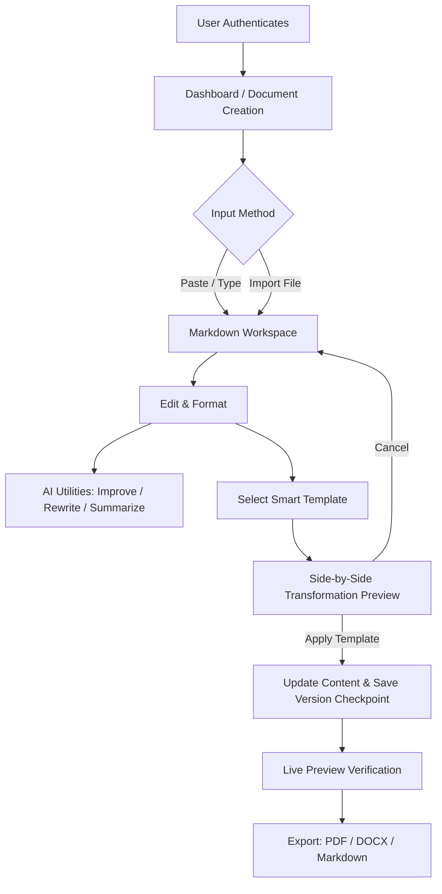

# Dastavezz


Dastavezz is a document editor designed for writing, restructuring, formatting, and exporting professional documents. It combines a Markdown editor with rule-based and AI-assisted layout transformations, live side-by-side previews, version checkpoints, and multi-format exports.

Live Application: [https://dastavezz.online/](https://dastavezz.online/)

---

## Preview

| Landing Page | Workspace Editor |
| :---: | :---: |
|  |  |

| Smart Template Preview | Dashboard |
| :---: | :---: |
|  |  |

---

## Why Dastavezz?

Most web-based document editors fall into two extremes: complex word processors with overwhelming toolbar buttons, or minimal plain-text Markdown editors that require manual styling work when exporting.

Dastavezz was built to solve this middle ground:
- Write in clean, structured Markdown or import existing text documents.
- Restructure content into targeted layouts (resumes, formal letters, technical reports) without losing original data.
- Preview PDF and document outputs side-by-side in real time.
- Keep track of document revisions automatically.

---

## Features

| Feature | Description |
| :--- | :--- |
| **Authentication** | Google Sign-In, Email/Password authentication, and profile state sync via Firebase Auth. |
| **Real-time Collaboration** | Multi-user document editing with Editor/Viewer role controls, Canva-like active collaborator presence avatars, and full audit logs. |
| **Document Dashboard** | Grid and list views, quick search, title editing, and batch management. |
| **Markdown Workspace** | Split-pane view with real-time live preview, word and character counters, and undo/redo stacks. |
| **File Imports** | Support for `.md`, `.txt`, `.docx`, and `.pdf` file parsing into editor content. |
| **Smart Template Engine** | Rule-based and AI structural reformatting for Resumes, Business Letters, and Reports. |
| **Side-by-Side Comparison** | Pre-apply preview modal comparing original document with transformed layout before committing. |
| **AI Writing Utilities** | Writing style improvement, professional tone rewrite, automatic title generation, and summaries. |
| **Version History** | Automated document snapshots and manual checkpoints prior to major template modifications. |
| **Multi-Format Export** | Direct export to PDF, DOCX (Microsoft Word), and Markdown formats. |
| **Design System** | Dark-mode interface built with Tailwind CSS, custom glassmorphism components, and responsive layouts. |
| **Progressive Web App (PWA)** | Standalone downloadable application with offline shell loading, custom splash screens, and mobile-first responsiveness. |

---

## Tech Stack

| Category | Technology |
| :--- | :--- |
| **Framework** | Next.js 15 (App Router) |
| **Language** | TypeScript |
| **Styling** | Tailwind CSS, Lucide React Icons |
| **UI Motion** | Framer Motion |
| **Backend & Auth** | Firebase Authentication, Firestore Database, Firebase Storage |
| **AI Integration** | Google Gemini API (`@google/genai` SDK) |
| **Document Parsing** | Marked HTML compiler, html2pdf.js |
| **Deployment** | Firebase App Hosting |

---

## Directory Structure

```text
dastavezz/
├── public/
│   ├── brand/
│   │   ├── dastavezz-icon.svg
│   │   └── dastavezz-logo.svg
│   └── screenshots/
├── src/
│   ├── app/
│   │   ├── api/
│   │   │   └── gemini/
│   │   │       └── route.ts
│   │   ├── dashboard/
│   │   │   └── page.tsx
│   │   ├── settings/
│   │   │   └── page.tsx
│   │   ├── workspace/
│   │   │   ├── page.tsx
│   │   │   └── [documentId]/
│   │   │       └── page.tsx
│   │   ├── layout.tsx
│   │   ├── page.tsx
│   │   └── icon.tsx
│   ├── components/
│   │   ├── brand/
│   │   ├── landing/
│   │   ├── layout/
│   │   ├── template/
│   │   ├── ui/
│   │   └── workspace/
│   ├── lib/
│   │   └── templates/
│   │       ├── templateAnalyzer.ts
│   │       ├── templateEngine.ts
│   │       └── templateFormatter.ts
│   ├── providers/
│   │   ├── AuthProvider.tsx
│   │   └── ToastProvider.tsx
│   ├── services/
│   │   ├── auth/
│   │   ├── firebase.ts
│   │   ├── documents.ts
│   │   └── gemini.ts
│   ├── templates/
│   │   ├── business-letter.ts
│   │   ├── project-report.ts
│   │   ├── resume.ts
│   │   └── types.ts
│   ├── types/
│   └── utils/
├── tailwind.config.ts
├── tsconfig.json
└── package.json
```

---

## Getting Started

### Prerequisites

Ensure you have Node.js 18.x or later installed along with npm or yarn.

### 1. Clone the Repository

```bash
git clone https://github.com/mrashis06/Dastavezz.git
cd Dastavezz
```

### 2. Install Dependencies

```bash
npm install
```

### 3. Configure Environment Variables

Create a `.env.local` file in the root directory:

```env
# Firebase Configuration
NEXT_PUBLIC_FIREBASE_API_KEY=your_firebase_api_key
NEXT_PUBLIC_FIREBASE_AUTH_DOMAIN=your_project.firebaseapp.com
NEXT_PUBLIC_FIREBASE_PROJECT_ID=your_project_id
NEXT_PUBLIC_FIREBASE_STORAGE_BUCKET=your_project.appspot.com
NEXT_PUBLIC_FIREBASE_MESSAGING_SENDER_ID=your_messaging_sender_id
NEXT_PUBLIC_FIREBASE_APP_ID=your_app_id

# Google Gemini API Key
GEMINI_API_KEY=your_gemini_api_key
```

### 4. Run Development Server

```bash
npm run dev
```

Open [http://localhost:3000](http://localhost:3000) in your browser.

### 5. Build for Production

```bash
npm run build
npm run start
```

---

## Workflow



---

## Progressive Web App (PWA) & Mobile Standalone

Dastavezz is fully optimized as an installable Progressive Web App (PWA), providing a native, full-screen downloadable experience for both desktop and mobile platforms.

- **Standalone Native Experience**: Hides browser search bars, address fields, and desktop wrappers to offer a premium full-screen editorial workspace.
- **Mobile-First Workspace Layout**: Optimized for screen widths under `1024px`, featuring a responsive bottom navigation bar to switch between the Editor, Live Document Preview, AI Assistant Panel, and Version Snapshot History.
- **Service Worker Caching**: Integrates a client-side Service Worker (`/sw.js`) that caches core application assets and handles background fetches.
- **Brand Consistency**: Configured dynamic manifests supporting custom maskable logos and startup icons matching high-resolution mobile retina screens.

### Installation Instructions
- **Desktop (Chrome / Edge / Safari)**: Click the **Download/Install App** shortcut icon in the browser address bar.
- **Android / Mobile Chrome**: Select **Add to Home Screen** from the browser's menu option.
- **iOS / Apple Safari**: Tap the **Share** menu button at the bottom of the browser and choose **Add to Home Screen**.

### Mobile Screenshots Reference

Save your mobile screenshot files inside `public/screenshots/mobile/` using the following exact filenames to display them in the README:

| 1. Landing (`landing.png`) | 2. Dashboard (`dashboard.png`) | 3. Live Preview (`preview.png`) |
| :---: | :---: | :---: |
|  |  |  |

| 4. AI Assistant (`ai.png`) | 5. Version History (`history.png`) |
| :---: | :---: |
|  |  |

---

## AI Features

- **Document Style Improvement**: Identifies grammar issues, improves clarity, and enhances formatting while keeping original meaning.
- **Professional Tone Rewrite**: Restructures content into formal, business-appropriate language.
- **Executive Summarization**: Extracts key bullet points, executive summaries, and reading metrics from large documents.
- **Smart Title Suggestion**: Evaluates document context and generates relevant document titles.
- **Template Transformation Engine**: Maps unformatted document text into structured template layouts (e.g. ATS Resume, Business Letter, Technical Report) without overwriting user data.

---

## Smart Templates

- **Professional Resume**: ATS-friendly layout emphasizing contact details, summary, experience bullet points, skills, and education.
- **Business Letter**: Formal corporate layout with date, sender/recipient metadata, salutation, body paragraphs, and formal closing.
- **Project Report**: Technical document structure with title header, executive summary blockquote, numbered sections, and conclusions.

---

## Export Options

- **Markdown (`.md`)**: Raw formatted Markdown source file.
- **PDF (`.pdf`)**: Vector PDF rendered from DOM elements matching export font size, margins, and page orientation settings.
- **DOCX (`.doc` / `.docx`)**: Formatted Word document generated from compiled HTML structures.

---

## Authentication

- **Google Sign-In**: Pop-up auth flow with automatic account creation detection.
- **Email & Password**: Account registration, login, password resets, and verification email dispatch.
- **Account Linking**: Connect or disconnect Google and Email credentials under user account settings.

---

## Deployment

Dastavezz is deployed using **Firebase App Hosting**, providing automatic Next.js App Router server-side rendering (SSR), API route execution, and static asset delivery.

To deploy using Firebase CLI:

```bash
npm run build
firebase deploy
```

---

## Future Roadmap

- [ ] Support for additional template categories (Academic Papers, Grants, Cover Letters).
- [ ] Collaborative editing via WebSockets.
- [ ] Direct Google Drive and Dropbox integration.
- [ ] Custom CSS layout theme designer for export customisation.

---

## Contributing

Contributions are welcome. Please follow these steps:

1. Fork the repository.
2. Create your feature branch (`git checkout -b feature/AmazingFeature`).
3. Commit your changes (`git commit -m 'Add some AmazingFeature'`).
4. Push to the branch (`git push origin feature/AmazingFeature`).
5. Open a Pull Request.

---

## License

Distributed under the MIT License. See `LICENSE` for details.

---

## Author

**Ashis Kumar Rai**

- GitHub: [https://github.com/mrashis06](https://github.com/mrashis06)
- Project Site: [https://dastavezz.online/](https://dastavezz.online/)

---

<p align="center">Made with ❤️ by Dastavezz</p>
