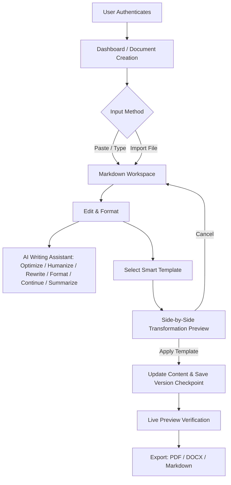

# Dastavezz


Dastavezz is a document workspace for people who want to write well and export fast. You get a clean Markdown editor, AI tools to polish your writing, smart templates to reshape your content into professional formats, and one-click export to PDF, DOCX, or Markdown.

Live Application: [https://dastavezz.online/](https://dastavezz.online/)

---

## Preview

| Landing Page | Workspace Editor |
| :---: | :---: |
|  |  |

| Smart Template Preview | Dashboard |
| :---: | :---: |
|  |  |

---

## Why Dastavezz?

Most document editors are either too heavy (Google Docs, Word) or too bare (plain Markdown). Dastavezz sits in between — you write freely in Markdown, then apply structure, polish it with AI, and export a clean result without fighting the tool.

- Import a file or start fresh and write in Markdown.
- Apply a smart template (resume, business letter, project report) without losing a single word.
- See exactly what your export looks like before you commit to it.
- Every major change is checkpointed, so you can always go back.

---

## Features

| Feature | Description |
| :--- | :--- |
| **Authentication** | Google Sign-In, Email/Password authentication, and profile state sync via Firebase Auth. |
| **Real-time Collaboration** | Multi-user document editing with Editor/Viewer role controls, Canva-like active collaborator presence avatars, and full audit logs. |
| **Document Dashboard** | Grid and list views, quick search, title editing, and batch management. |
| **Markdown Workspace** | Split-pane view with real-time live preview, word and character counters, and undo/redo stacks. |
| **File Imports** | Support for `.md`, `.txt`, `.docx`, and `.pdf` file parsing into editor content. |
| **Smart Template Engine** | Rule-based and AI structural reformatting for Resumes, Business Letters, and Reports. |
| **Side-by-Side Comparison** | Pre-apply preview modal comparing original document with transformed layout before committing. |
| **AI Writing Utilities** | Writing style improvement, professional tone rewrite, automatic title generation, and summaries. |
| **Version History** | Automated document snapshots and manual checkpoints prior to major template modifications. |
| **Multi-Format Export** | Direct export to PDF, DOCX (Microsoft Word), and Markdown formats. |
| **Design System** | Dark-mode interface built with Tailwind CSS, custom glassmorphism components, and responsive layouts. |
| **Progressive Web App (PWA)** | Standalone downloadable application with offline shell loading, custom splash screens, and mobile-first responsiveness. |

---

## Tech Stack

| Category | Technology |
| :--- | :--- |
| **Framework** | Next.js 15 (App Router) |
| **Language** | TypeScript |
| **Styling** | Tailwind CSS, Lucide React Icons |
| **UI Motion** | Framer Motion |
| **Backend & Auth** | Firebase Authentication, Firestore Database, Firebase Storage |
| **AI Integration** | Google Gemini API (`@google/genai` SDK) |
| **Document Parsing** | Marked HTML compiler, html2pdf.js |
| **Deployment** | Firebase App Hosting |

---

## Directory Structure

```text
dastavezz/
├── public/
│   ├── brand/
│   │   ├── dastavezz-icon.svg
│   │   └── dastavezz-logo.svg
│   └── screenshots/
├── src/
│   ├── app/
│   │   ├── api/
│   │   │   └── gemini/
│   │   │       └── route.ts
│   │   ├── dashboard/
│   │   │   └── page.tsx
│   │   ├── settings/
│   │   │   └── page.tsx
│   │   ├── workspace/
│   │   │   ├── page.tsx
│   │   │   └── [documentId]/
│   │   │       └── page.tsx
│   │   ├── layout.tsx
│   │   ├── page.tsx
│   │   └── icon.tsx
│   ├── components/
│   │   ├── brand/
│   │   ├── landing/
│   │   ├── layout/
│   │   ├── template/
│   │   ├── ui/
│   │   └── workspace/
│   ├── lib/
│   │   └── templates/
│   │       ├── templateAnalyzer.ts
│   │       ├── templateEngine.ts
│   │       └── templateFormatter.ts
│   ├── providers/
│   │   ├── AuthProvider.tsx
│   │   └── ToastProvider.tsx
│   ├── services/
│   │   ├── auth/
│   │   ├── firebase.ts
│   │   ├── documents.ts
│   │   └── gemini.ts
│   ├── templates/
│   │   ├── business-letter.ts
│   │   ├── project-report.ts
│   │   ├── resume.ts
│   │   └── types.ts
│   ├── types/
│   └── utils/
├── tailwind.config.ts
├── tsconfig.json
└── package.json
```

---

## Getting Started

### Prerequisites

Ensure you have Node.js 18.x or later installed along with npm or yarn.

### 1. Clone the Repository

```bash
git clone https://github.com/mrashis06/Dastavezz.git
cd Dastavezz
```

### 2. Install Dependencies

```bash
npm install
```

### 3. Configure Environment Variables

Create a `.env.local` file in the root directory:

```env
# Firebase Configuration
NEXT_PUBLIC_FIREBASE_API_KEY=your_firebase_api_key
NEXT_PUBLIC_FIREBASE_AUTH_DOMAIN=your_project.firebaseapp.com
NEXT_PUBLIC_FIREBASE_PROJECT_ID=your_project_id
NEXT_PUBLIC_FIREBASE_STORAGE_BUCKET=your_project.appspot.com
NEXT_PUBLIC_FIREBASE_MESSAGING_SENDER_ID=your_messaging_sender_id
NEXT_PUBLIC_FIREBASE_APP_ID=your_app_id

# Google Gemini API Key
GEMINI_API_KEY=your_gemini_api_key
```

### 4. Run Development Server

```bash
npm run dev
```

Open [http://localhost:3000](http://localhost:3000) in your browser.

### 5. Build for Production

```bash
npm run build
npm run start
```

---

## Workflow



---

## Progressive Web App (PWA) & Mobile Standalone

You can install Dastavezz directly on your phone or desktop and use it like a native app — no app store needed.

- **No browser clutter**: Once installed, it opens in full-screen mode with no address bars, tabs, or browser UI in the way. Just your document.
- **Works great on mobile**: On smaller screens, a bottom navigation bar lets you jump between the Editor, Live Preview, AI Assistant, and Version History without any cramped sidebars.
- **Loads fast, even offline**: A service worker caches the core app shell so Dastavezz loads instantly, even on a slow connection.
- **Looks native**: Custom app icons and splash screens match the Dastavezz brand — it won't look like a browser shortcut on your home screen.

### How to Install
- **Desktop (Chrome / Edge / Safari)**: Look for the install icon in the address bar and click it.
- **Android**: Open the browser menu and tap **Add to Home Screen**.
- **iOS (Safari)**: Tap the **Share** button at the bottom, then choose **Add to Home Screen**.

### Mobile Screenshots Reference

Save your mobile screenshot files inside `public/screenshots/mobile/` using the following exact filenames to display them in the README:

| 1. Landing (`landing.png`) | 2. Dashboard (`dashboard.png`) | 3. Live Preview (`preview.png`) |
| :---: | :---: | :---: |
|  |  |  |

| 4. AI Assistant (`ai.png`) | 5. Version History (`history.png`) |
| :---: | :---: |
|  |  |

---

## AI Features

- **Optimize Document**: Runs a full quality pipeline in one click — grammar fixes, better sentence flow, improved readability, cleaner wording, and consistent formatting — without changing what you meant to say.
- **Humanize**: Rewrites robotic or AI-sounding text to feel natural, fluent, and genuinely human while keeping the tone professional.
- **Professional Rewrite**: Choose a writing style (Professional, Academic, Business, Technical, Formal, or Concise) and get a full rewrite of your document in that exact voice.
- **Improve Formatting**: Cleans up the visual structure only — headings, bullet points, spacing, and list alignment — without touching your actual words.
- **Continue Writing**: Reads your existing document and keeps writing from where you left off, matching your tone and style.
- **Summarize**: Condenses your document into a Short Summary, Detailed Summary, or Bullet Points — you choose the format before it runs.

---

## Smart Templates

- **Professional Resume** — Restructures your content into a clean, ATS-friendly layout. Contact info, career summary, experience, skills, and education all land in the right place.
- **Business Letter** — Formats your text into a proper formal letter with date, sender/recipient details, salutation, and a professional closing.
- **Project Report** — Organises content into a structured technical report with a title header, executive summary, numbered sections, and a conclusion.

---

## Export Options

- **Markdown (`.md`)** — Exports the raw Markdown source. Useful for developers, static sites, or keeping a clean backup.
- **PDF (`.pdf`)** — Renders a print-ready PDF directly from the live preview. Font size, margins, and page orientation all match what you see on screen.
- **DOCX (`.docx`)** — Exports a Microsoft Word compatible file. Open it, share it, or hand it off — it just works.

---

## Authentication

- **Google Sign-In** — One click and you're in. If you don't have an account yet, it creates one automatically.
- **Email & Password** — Standard sign-up with login, password reset, and email verification support.
- **Account Linking** — Already signed in with Google but want to add a password too? You can connect and disconnect both from your account settings.

---

## Deployment

Dastavezz runs on **Firebase App Hosting**. It handles server-side rendering, API routes, and static assets automatically — no extra config needed.

To deploy using Firebase CLI:

```bash
npm run build
firebase deploy
```

---

## What's Coming Next

- [ ] More template types — Academic Papers, Grants, Cover Letters.
- [ ] Real-time collaborative editing.
- [ ] A custom theme designer so you can control exactly how your exports look.

---

## Contributing

PRs are welcome. Here's how to get started:

1. Fork the repo.
2. Create a branch for your change (`git checkout -b feature/your-feature`).
3. Commit your work (`git commit -m 'Add your feature'`).
4. Push it (`git push origin feature/your-feature`).
5. Open a Pull Request and describe what you changed.

---

## License

Distributed under the MIT License. See `LICENSE` for details.

---

## Author

**Ashis Kumar Rai**

- GitHub: [https://github.com/mrashis06](https://github.com/mrashis06)
- Project Site: [https://dastavezz.online/](https://dastavezz.online/)

---

<p align="center">Made with ❤️ by Dastavezz</p>
